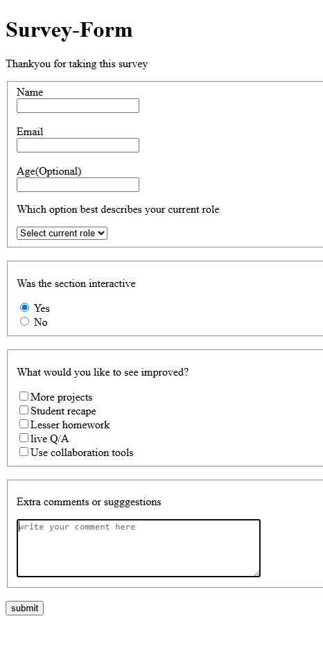

Here is a clean, professional **README.md** you can use for your project:

---

# 📋 Survey Form

This project is a simple and clean **Survey Form** built using basic HTML. It is designed to collect user input such as personal details, opinions, and suggestions. The form includes text fields, radio buttons, checkboxes, a dropdown menu, and a textarea for comments.

---




## 🚀 Features

* **User Information Collection**
  Collects name, email, and optional age.

* **Role Selection**
  Dropdown list to choose the user’s current role.

* **Survey Questions**

  * Radio buttons to check if the section was interactive
  * Checkboxes for improvement suggestions

* **Comment Box**
  A textarea for additional comments or suggestions.

* **Submit Button**
  A simple button to submit the form (non-functional without added backend).

---

## 📂 Project Structure

```
├── index.html
└── README.md
```

---

## 🧾 HTML Form Sections Overview

### 1. **Personal Information**

Includes:

* Name (text input)
* Email (text input)
* Age (optional)

### 2. **Interactivity Feedback**

Radio buttons:

* Yes
* No

### 3. **Improvements**

Checkbox options like:

* More projects
* Student recap
* Lesser homework
* Live Q/A
* Collaboration tools

### 4. **Extra Comments**

A textarea for users to enter any additional feedback.

---

## 🛠️ Technologies Used

* **HTML5**

No CSS or JavaScript is included in this version. You may extend the project by styling the form or adding interactivity.

---

## 📦 How to Use

1. Download or clone the repository.
2. Open the `index.html` file in any web browser.
3. Fill out the form and explore its structure.

---

## 📌 Future Improvements (Optional)

* Add form validation
* Include CSS styling for better user experience
* Enable backend form submission
* Add responsive layout

---

## 🖼️ Preview (Optional)

*Add a screenshot here if needed.*

https://sarathp678.github.io/survey--form/

---

If you'd like, I can also:

✅ Create a styled version using CSS
✅ Add JavaScript validation
✅ Help you organize this into a full GitHub-ready project

Just let me know!
